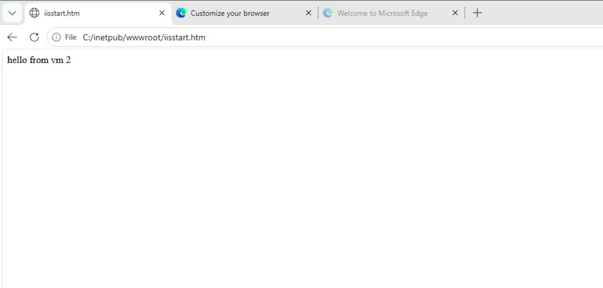
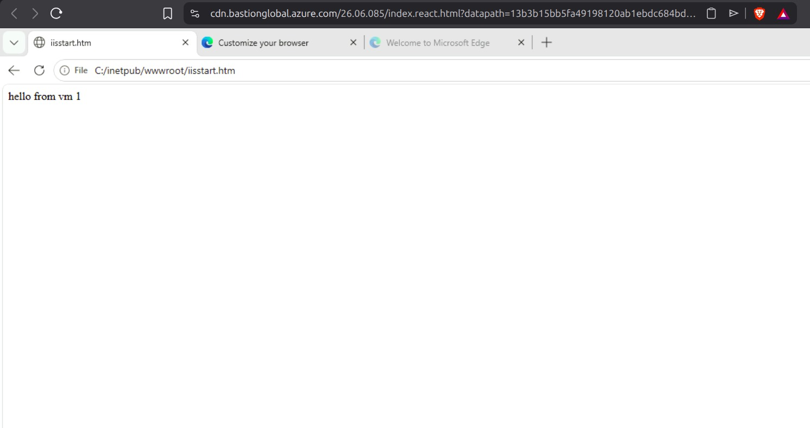
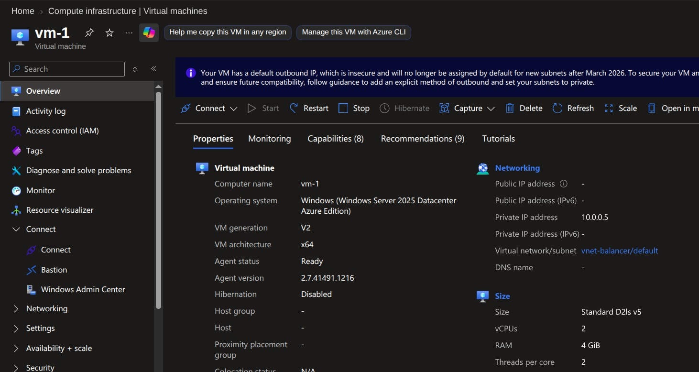
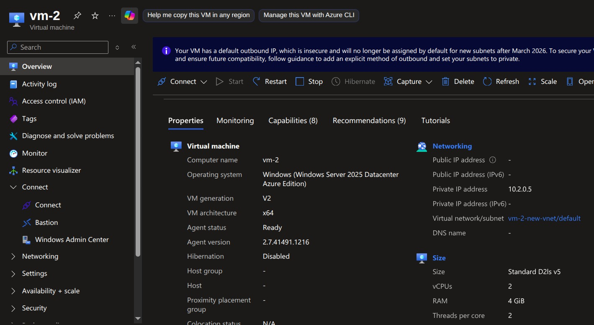
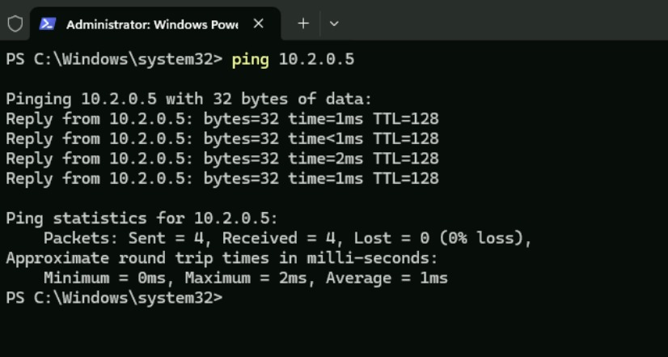
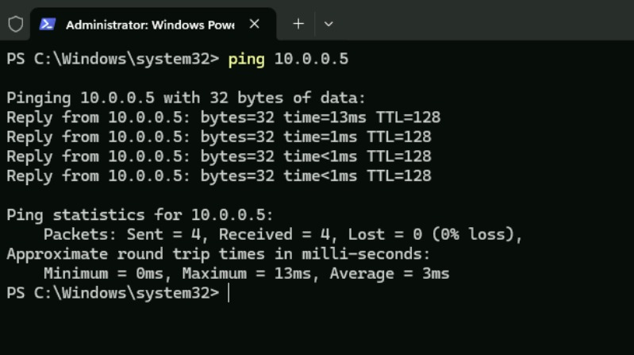
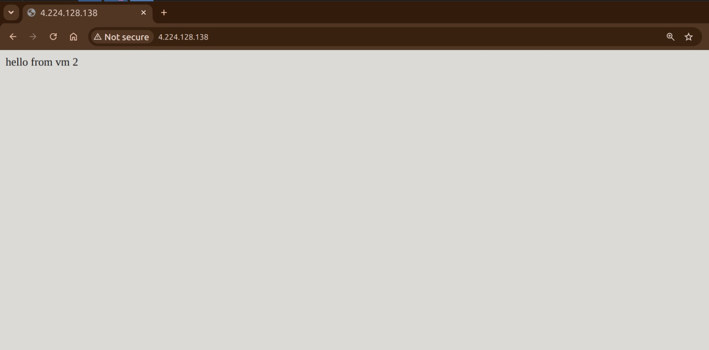
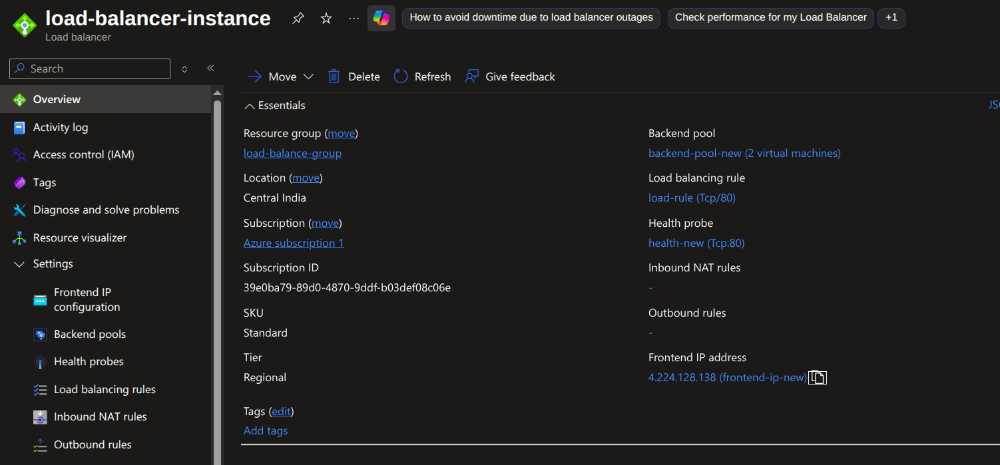
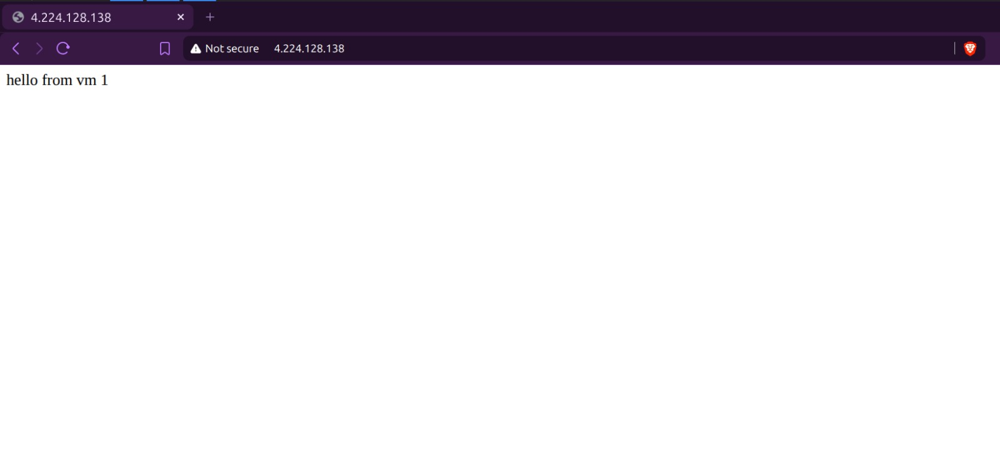

# Azure Cloud Training Tasks

This repository contains my hands-on Azure Cloud training work, with screenshots documenting the configuration and testing of Azure Virtual Machines, Virtual Network (VNet) Peering, IIS web servers, and an Azure Load Balancer.

The purpose of this repository is to keep a structured record of the cloud infrastructure tasks completed during my Azure training.

---

## Tasks Covered

1. **Creating and configuring Azure Virtual Machines**
2. **Installing and configuring IIS on Windows Server VMs**
3. **Configuring VNet Peering**
4. **Testing private network connectivity between VMs**
5. **Creating and configuring an Azure Load Balancer**
6. **Adding multiple VMs to a backend pool**
7. **Configuring a health probe and load-balancing rule**
8. **Testing the application through the Load Balancer's public IP**

---

## Repository Structure

```text
azure-cloud-training/
│
├── README.md
│
└── assets/
    ├── 01-virtual-machines/
    │   ├── iis-server-on-vm1.jpeg
    │   └── iis-server0on-vm2.jpeg
    │
    ├── 02-vnet-peering/
    │   ├── v-net-peering-config.jpeg
    │   ├── vnet-peer-1.jpeg
    │   ├── vnet-peer-2.jpeg
    │   ├── ping-1.jpeg
    │   └── ping-2.jpeg
    │
    └── 03-load-balancer/
        ├── load-balance.jpeg
        ├── load-balance2.jpeg
        └── load-balance-config.jpeg
```

---

# 1. Azure Virtual Machines

Two Windows Server 2025 Datacenter Azure Virtual Machines were created for the lab:

- **VM-1**
  - Private IP: `10.0.0.5`
  - VNet: `vnet-balancer`
  - Subnet: `default`

- **VM-2**
  - Private IP: `10.2.0.5`
  - VNet: `vm-2-new-vnet`
  - Subnet: `default`

Both VMs use the `Standard D2ls v5` size with 2 vCPUs and 4 GiB RAM.

The VMs were used as backend web servers for the load-balancing and networking exercises.

---

# 2. IIS Web Server Configuration

IIS (Internet Information Services) was installed on both Windows Server VMs.

The default IIS page was replaced/edited to provide a simple way to identify which VM served a request.

### VM-1

The IIS page returns:

```text
hello from vm 1
```



### VM-2

The IIS page returns:

```text
hello from vm 2
```



This makes it easy to observe which backend VM is responding when requests are sent through the Load Balancer.

---

# 3. VNet Peering

Virtual Network Peering was configured to allow communication between the VNets containing the two VMs.

The configuration connects:

```text
vnet-balancer
      │
      │ VNet Peering
      │
      ▼
vm-2-new-vnet
```

The purpose of this configuration was to establish private network connectivity between the two Azure VNets.

### Peering Configuration



### VNet / VM Configuration




---

# 4. Connectivity Testing

After configuring VNet Peering, connectivity between the two private IP addresses was tested using `ping`.

### VM-1 → VM-2

VM-1 successfully reached VM-2 at:

```text
10.2.0.5
```

The test showed:

```text
Packets: Sent = 4, Received = 4, Lost = 0 (0% loss)
```



### VM-2 → VM-1

VM-2 successfully reached VM-1 at:

```text
10.0.0.5
```

The test showed:

```text
Packets: Sent = 4, Received = 4, Lost = 0 (0% loss)
```



This verified that the two VMs could communicate over their private network addresses.

---

# 5. Azure Load Balancer

An Azure Load Balancer was configured to distribute incoming HTTP traffic between the two IIS web servers.

### Load Balancer

**Name:** `load-balancer-instance`

**Resource Group:** `load-balance-group`

**Location:** Central India

**SKU:** Standard

**Tier:** Regional

The Load Balancer uses the following components:

```text
                    Internet
                       │
                       │ HTTP : 80
                       ▼
              ┌─────────────────┐
              │ Azure Load      │
              │ Balancer        │
              │                 │
              │ Public IP       │
              │ 4.224.128.138   │
              └────────┬────────┘
                       │
              Backend Pool
                 ┌─────┴─────┐
                 │           │
                 ▼           ▼
              VM-1         VM-2
           10.0.0.5      10.2.0.5
                 │           │
                 ▼           ▼
              IIS Server  IIS Server
           "hello from    "hello from
              vm 1"          vm 2"
```

---

## Backend Pool

The Load Balancer backend pool contains both virtual machines:

```text
backend-pool-new
├── VM-1
└── VM-2
```

This allows incoming traffic to be distributed between the two IIS servers.



---

## Health Probe

A health probe was configured to check whether the backend servers are available.

```text
Protocol: TCP
Port: 80
```

Only healthy backend instances should receive traffic from the Load Balancer.



---

## Load Balancing Rule

A load-balancing rule was configured for:

```text
Protocol: TCP
Frontend Port: 80
Backend Port: 80
```

This maps incoming HTTP traffic on the Load Balancer's frontend to port 80 on the backend VMs.



---

# 6. Load Balancer Testing

The Load Balancer was accessed through its public frontend IP:

```text
4.224.128.138
```

The IIS responses from the backend servers were:

```text
hello from vm 1
```

and

```text
hello from vm 2
```

Because the two servers return different messages, they can be easily distinguished during testing.

This demonstrates the basic flow:

```text
Client
  │
  │ HTTP Request
  ▼
Load Balancer
  │
  ├──────────────► VM-1 ──► IIS ──► "hello from vm 1"
  │
  └──────────────► VM-2 ──► IIS ──► "hello from vm 2"
```

---

# Concepts Practiced

Through these tasks, I worked with the following Azure concepts:

- Azure Virtual Machines
- Windows Server
- IIS Web Server
- Private IP addresses
- Virtual Networks (VNets)
- Subnets
- VNet Peering
- Network connectivity testing
- Azure Load Balancer
- Frontend IP configuration
- Backend pools
- Health probes
- Load-balancing rules
- TCP/HTTP traffic on port 80
- Basic cloud networking and infrastructure

---

## Outcome

The completed setup demonstrates a basic highly available web-server architecture in Azure:

- Two Windows Server VMs host the same type of web service.
- IIS runs on both VMs.
- The VMs communicate over private Azure networking.
- VNet Peering provides connectivity between the VNets.
- An Azure Load Balancer exposes a single frontend IP.
- The Load Balancer uses a backend pool containing both VMs.
- A health probe checks backend availability.
- HTTP traffic is forwarded to the IIS servers through port 80.

This lab provided hands-on experience with Azure compute, networking, and traffic distribution.
