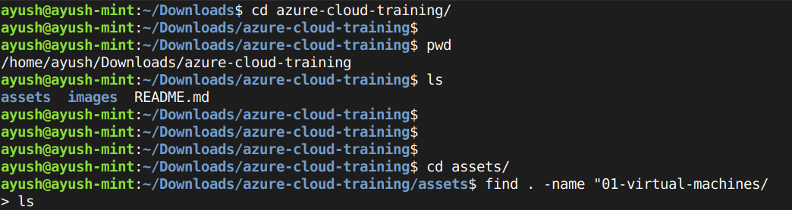
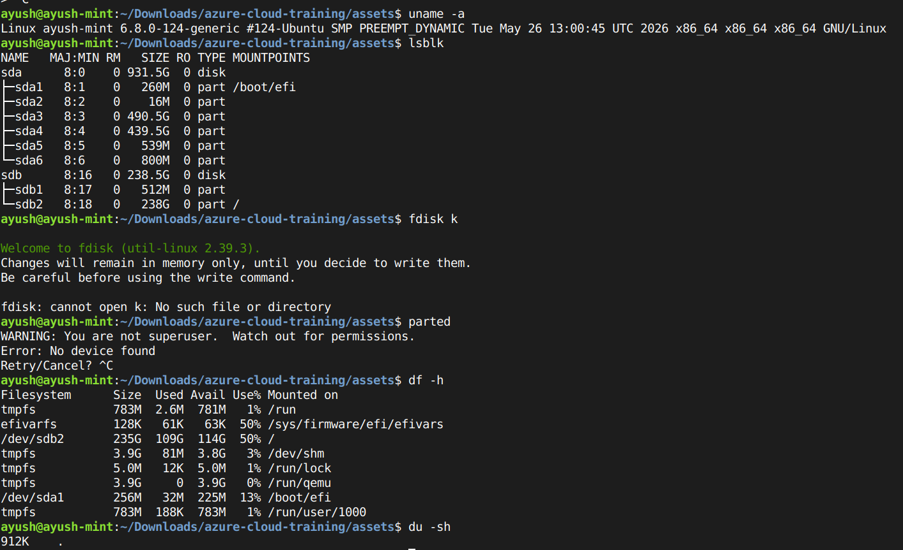

# Linux Fundamentals, File System & Storage Management

This task covered basic Linux operations including file system navigation, file searching, system information commands, and disk/partition management.

## Summary of Work Done

* Understood Linux file system structure and key directories
* Practiced basic file and directory operations
* Learned commands to search files and content
* Explored system, CPU, memory, and disk information
* Worked with disk partitions and storage concepts (viewing, mounting basics)

---

## Common Commands Used

### File & Directory Operations

```bash
pwd
ls
cd
mkdir
touch
cp
mv
rm
```

### File Searching

```bash
find . -name "*.txt"
locate filename
grep "text" file.txt
```


### System Information

```bash
uname -a
whoami
hostname
lscpu
free -h
```

### Disk & Storage

```bash
lsblk
df -h
du -sh
```



### Partition & Mounting (basic understanding)

```bash
fdisk
parted
mount
umount
```

---

## Outcome

Gained basic hands-on experience with Linux commands, file system navigation, system inspection, and storage management concepts.